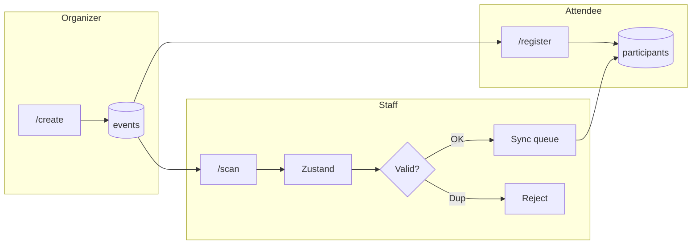

# bdForms

> **Fast-Track Registration Platform** — registrasi event paperless, check-in di bawah 3 detik, dan scanner offline-first yang tetap jalan saat sinyal venue bermasalah.

[](https://bdforms.vercel.app)
[](https://nextjs.org/)
[](https://react.dev/)
[](https://supabase.com/)
[](https://www.typescriptlang.org/)

## Demo

**Production:** [https://bdforms.vercel.app](https://bdforms.vercel.app)

**Alur uji cepat (juri):**

1. Buka `/create` → buat event → salin **link pendaftaran** & **link scanner**.
2. Buka link pendaftaran di HP peserta → isi nama, email, tanda tangan → simpan QR.
3. Buka link scanner di HP panitia → sync data → scan QR → layar hijau (verified) atau merah (duplicate).

---

## Tentang proyek

**bdForms** adalah platform registrasi dan check-in event untuk **MVP hackathon**. Organizer membuat event dalam hitungan detik, peserta mendaftar dengan tanda tangan digital dan QR unik, lalu panitia memindai QR dengan validasi **lokal (offline-first)** tanpa fetch database per scan.

| | |
|---|---|
| **Tagline** | Fast-Track Registration Under 3 Seconds |
| **Target** | Organizer event kampus, seminar, dan komunitas |

---

## Masalah & solusi

| Pain point | Solusi |
|------------|--------|
| Antrian panjang di meja registrasi | Self-service registration + QR check-in cepat |
| Sinyal Wi-Fi venue tidak stabil | Data peserta di-cache (**Zustand**); validasi scan **O(1)** di memori lokal |
| QR/screenshot bisa disalahgunakan | Jam digital real-time + state **REJECTED** untuk scan ganda |
| Alur manual & kertas | **100% paperless** — TTD digital (canvas → Base64) |

---

## Fitur utama

### MVP (3 layar inti)

| Route | Peran | Ringkasan |
|-------|-------|-----------|
| `/register?eventId=` | Peserta | Nama, email, TTD → QR unik (`qr_token`) |
| `/scan?eventId=` | Panitia | Scan QR (`html5-qrcode`), verifikasi offline-first, sync ke server |
| *(state di `/scan`)* | Keamanan | **VERIFIED** (hijau) / **REJECTED** (merah) |

### Organizer & marketing

| Route | Peran |
|-------|-------|
| `/` | Landing page |
| `/create` | Buat event + magic links |
| `/pricing` | Tier Free & Pro (billing placeholder) |

**USP:** offline-first sub-3-second check-in · anti duplicate scan · signature on-device

---

## Tech stack

| Layer | Teknologi |
|-------|-----------|
| Framework | Next.js 16 (App Router) |
| UI | React 19, Tailwind CSS 4, shadcn/ui |
| State (scanner) | Zustand |
| Database | Supabase (PostgreSQL) |
| QR | `qrcode.react`, `html5-qrcode` |
| Tanda tangan | `react-signature-canvas` |

---

## Arsitektur



**Catatan MVP:** Row Level Security (RLS) dinonaktifkan untuk kecepatan hackathon. Production memakai RLS per `event_id`.

---

## Instalasi lokal

### Prasyarat

- Node.js 20+
- Akun [Supabase](https://supabase.com/)

### Langkah

```bash
git clone <url-repo-anda>
cd bdforms
npm install
```

Buat `.env.local`:

```env
NEXT_PUBLIC_SUPABASE_URL=https://<project-ref>.supabase.co
NEXT_PUBLIC_SUPABASE_ANON_KEY=<anon-key>
NEXT_PUBLIC_EVENT_ID=<uuid-event-demo>
```

```bash
npm run dev
```

Buka [http://localhost:3000](http://localhost:3000).

### Build

```bash
npm run build
npm start
```

---

## Database

1. Buat project Supabase.
2. Jalankan [`schema.sql`](./schema.sql) di SQL Editor.
3. Salin `id` dari seed event ke `NEXT_PUBLIC_EVENT_ID` (opsional; flow utama memakai `?eventId=` dari `/create`).

Dokumen produk: [`📑 PRODUCT REQUIREMENTS DOCUMENT (PRD) - MVP BDFORMS.md`](./📑%20PRODUCT%20REQUIREMENTS%20DOCUMENT%20(PRD)%20-%20MVP%20BDFORMS.md)

---

## Struktur proyek

```
bdforms/
├── app/
│   ├── page.tsx          # Landing
│   ├── create/           # Buat event + magic links
│   ├── register/         # Pendaftaran peserta + QR
│   ├── scan/             # Scanner + verifikasi
│   └── pricing/
├── components/
│   ├── SiteNav.tsx
│   └── SignaturePad.tsx
├── store/useScannerStore.ts
├── lib/supabase.ts
└── schema.sql
```

---

## Roadmap

- Dashboard analytics & laporan
- Pengiriman QR via email
- Face match & hardware scanner
- Supabase Storage untuk TTD
- RLS per `event_id`
- Billing tier Pro

---

<p align="center">© 2026 bdForms · Built for speed.</p>
